# Git crash course

## Davide Alberani <da@erlug.linux.it> 2017

 
Non-corso per non prendere a martellate il monitor quando usate Git.

 
 
This work is licensed under the Creative Commons Attribution-ShareAlike 4.0 International License: http://creativecommons.org/licenses/by-sa/4.0/

---

## A chi è rivolto

A chi si trova a volere/dovere usare Git, ed è ancora alle prime armi.

---

## Struttura del corso

 

## Parte 1

Le basi per lavorare in locale e collaborare con altri usando il forking workflow, da applicare senza porsi troppe domande.

 

## Parte 2

Una serie di strumenti avanzati, per chi ci ha preso gusto e vuole approfondire lo strumento.

---

## Cosa verrà trattato

* i comandi essenziali (porcelain) da riga di comando
* come gestire i branch
* le basi per lavorare con repository remoti

-----

## Cosa NON verrà trattato

* gli internals (plumbing) di Git
* le GUI
* amministrazione di un repository remoto
* flame wars sui workflow

---

## Cosa è Git

Un sistema di controllo versione distribuito.

Serve per tener traccia dei cambiamenti al proprio codice e per facilitare lo sviluppo condiviso. Va ricordato che Git è nato soprattutto per aiutare chi deve integrare il codice altrui, e non tanto per il singolo sviluppatore.

 
Il resto lo spiega meglio Wikipedia: https://it.wikipedia.org/wiki/Git%5F%28software%29

-----

## Cosa NON è Git

* non è Subversion o CVS
* non è un sistema di backup
* non è un sistema per fare deploy (o magari sì, ma rifletteteci)

-----

## Si dice in giro

*Git non avrà segreti per voi, una volta compreso...*

* ...il data model (objects, blobs, trees, commits, refs, tags, ...)
* ...il fatto che tutto è locale
* ...che i commit sono in realtà snapshot, e non delta rispetto allo stato precedente
* ...una qualche astrusa teoria a caso

 

### Onestamente?

Tutto vero, ma la sua user interface è un mezzo disastro.

---

## Le basi: definizioni

* **Working directory**: i file su cui state lavorando

* **Staging area** (o **Index**): dove mettiamo da parte le modifiche che finiranno nel prossimo commit

* **Commit**: snapshot dello stato in un certo momento

* (fare) **Checkout**: aggiornare i file nella working directory ad un dato branch/commit/...

---

## Le basi: prepariamo l'ambiente

    $ git config --global user.name "Davide Alberani"
    $ git config --global user.email da@erlug.linux.it
    $ git config --global color.ui auto

 

### Bonus track

* cercare un esempio di ~/.gitconfig avanzato, con qualche alias per i comandi principali

-----

## Parte 1

In cui forniamo un workflow precotto per chi non vuole porsi troppe domande, adatto allo sviluppo in solitaria o con pochi altri contributori.

Iniziamo lavorando in locale, per poi vedere come interagire con altri sviluppatori.

-----

## Le basi: creare un repository

Creare un nuovo repository partendo da una directory (vuota o meno):

    $ git init

Clonare un repository remoto esistente:

    $ git clone https://github.com/user/repo.git

-----

## creare un repository: cosa è successo?

È stata creata la directory **.git** (il **repository**); se abbiamo fatto un clone, sono stati aggiunti i riferimenti al remote.

 

### Bonus track

* i repository remoti vengono di norma creati con **--bare** e non hanno working directory
* si può posizionare la directory .git in un altro path con **--separate-git-dir**

---

<!-- .slide: class="two-cols" -->

## Le basi: status

Vedere lo stato del sistema:

    $ git status [-s]

 

### Stati dei file

* **Untracked**: nuovi file nella working directory, non ancora aggiunti

* **Unmodified**: file che non sono cambiati dal commit precedente

* **Modified**: modificati nella working area e non ancora aggiunti alla staging area

* **Staged**: nella staging area, pronti per il prossimo commit

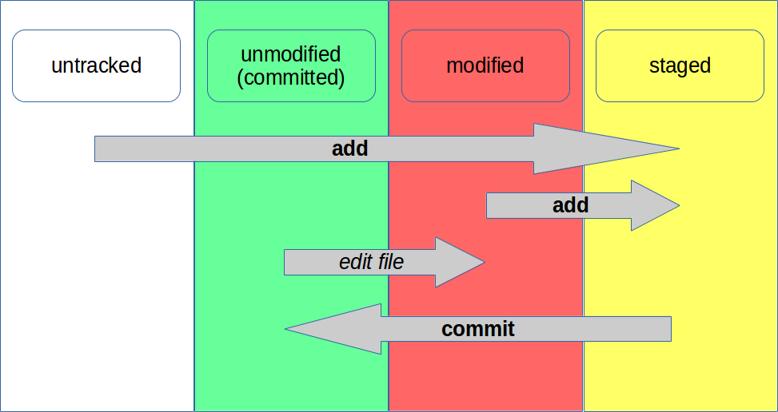

---

## Le basi: add e commit

Modifichiamo un file ed aggiungiamolo alla staging area:

    $ git add prova.txt

Committiamolo:

    $ git commit [-m "messaggio di commit"]

Verifichiamo quanto accaduto:

    $ git log

-----

## Le basi: add e commit

 

### Cosa è successo?

Abbiamo aggiunto un file alla staging area, per poi salvare uno snapshot del nostro lavoro.

 

### Bonus track

* git rm, git mv
* come scrivere un messaggio di commit che non susciti sgomento?
* le directory vuote non vengono salvate: .gitkeep / .gitignore

---

## Cosa sono i commit

Sono uno snapshot dell'intero stato del sistema in un dato momento, **identificati da un hash**.

I commit hash sono generati partendo da: messaggio, committer, author, dates, tree, parent hash.

 

### Bonus track

* .gitignore per ignorare certi file
* è possibile abbreviare gli hash, purché rimangano univoci.
* vedere https://blog.thoughtram.io/git/2014/11/18/the-anatomy-of-a-git-commit.html
* e anche https://git-scm.com/book/it/v2/Git-Internals-Git-References

---

## Le basi: tag

Un tag è un puntatore ad un commit:

    $ git tag -a v1.0

 

### Bonus track

* esistono sia i tag *lightweight* che *annotated*. La differenza principale è che i primi sono solo dei puntatori, i secondi sono oggetti completi: hanno un author e possono essere firmati.

---

## Le basi: la history

    $ git log [--stat] [--patch] [--graph] [--decorate] [--color] [-2]

Rappresenta la storia dei commit fino al punto corrente (o da/a qualsiasi punto indicato).

Si può limitare agli ultimi N commit con **-N**

 

### Bonus track

Visualizzare solo i commit che hanno coinvolto un dato file:

    $ git log -- file.txt

---

## Le basi: diff

Modifichiamo un file, senza aggiungerlo alla staging area:

    $ git diff

Per vedere quanto è stato posto in staging area:

    $ git diff --staged

---

## Aggiustare i danni

Modificare l'ultimo commit (aggiungere un file, modificare il commit message o l'autore, ...):

    $ git commit --amend [--author="Name Surname <user@example.com>"]

Un file stato aggiunto per sbaglio alla staging area:

    $ git reset HEAD -- file

Riportare un file modificato nell'ultimo stato committato/staged:

    $ git checkout -- file

-----

## Aggiustare i danni: più forte

Ho fatto un casino nella working directory.  Riportiamo tutto allo stato dell'ultimo commit:

    $ git reset --hard HEAD

Voglio creare un nuovo commit che annulla le modifiche introdotte da un commit precedente:

    $ git revert [-n] <commit>

---

## Branches: cosa sono e perché usarli?

Sono puntatori mobili, spostati ad ogni nuovo commit.

Servono a separare diversi filoni di sviluppo e ad integrare i contributi di altri.

-----

## Branches: creazione

Creare un branch:

    $ git branch fix/bug-123

Visualizzare tutti i branch:

    $ git branch -a

Cancellare un branch locale:

    $ git branch -d [--force] fix/bug-123

-----

## Branches: spostiamoci

Spostarsi su un branch:

    $ git checkout fix/bug-123

Creare e spostarsi in un singolo comando:

    $ git checkout -b fix/bug-123

 

### Bonus track

* nello spostarsi, Git cerca di mantenere i cambiamenti presenti nella working directory e nella staging area

-----

## Branches: approfondiamo

* **master** è solamente un default

* fate caso all'asterisco: è il branch corrente

* dare nomi significativi; usate prefissi (bugfix/, fix/, improvement/, feature/, task/) e issue di riferimento

* **refs**: nome collettivo per riferirsi ad HEAD, branches, tags

---

## Rimettere insieme i pezzi: merge

Partendo da master:

    $ git branch -b fix/bug-123
    $ # editiamo nuovofile.txt
    $ git add nuovofile.txt
    $ git commit

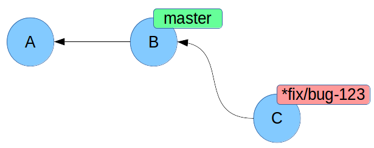

    $ git checkout master
    $ git merge fix/bug-123

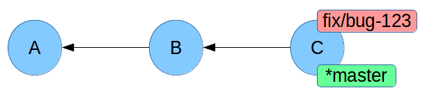

---

## Merge: cosa è successo?

**fast-forward**! master era più indietro rispetto a fix/bug-123, e quindi abbiamo semplicemente spostato il puntatore master.

Non è stato neppure creato un nuovo commit.

Il comando commit ha le opzioni **--ff-only** e **--no-ff** per decidere come comportarsi.

-----

## Risoluzione dei conflitti

Partendo da master:

    $ git branch -b fix/bug-123
    $ # editiamo file.txt
    $ git add file.txt
    $ git commit

    $ git checkout master
    $ # editiamo file.txt in maniera differente, sulle stesse righe
    $ git add file.txt
    $ git commit

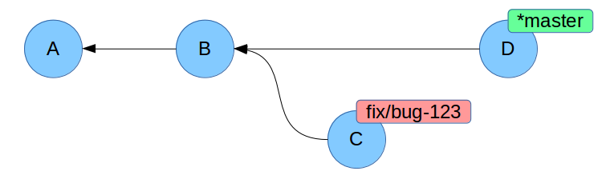

-----

## Risoluzione dei conflitti

Mergiamo:

    $ git merge fix/bug-123
    $ # risolviamo i conflitti
    $ git add file.txt
    $ git commit

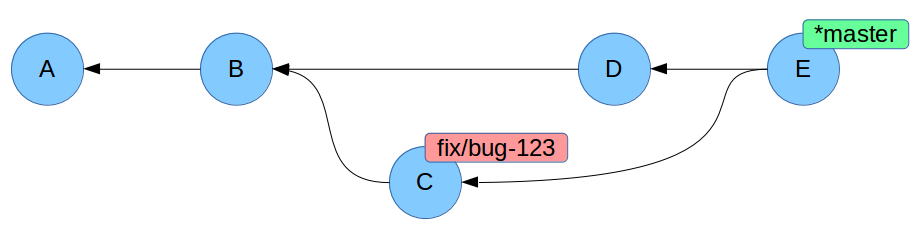

-----

## Conflict files

Cercare sempre tutti i markers **<<<<<<<**, **=======**, **>>>>>>>**

 

### Bonus track

* potete usare **meld** come GUI per risolvere i conflitti

---

## Lavorare con repository remoti

    $ git remote add origin https://github.com/user/repo.git
    $ git remote -v

 

## Bonus track

* **origin** è solamente un default
* l'associazione tra branch remoti e locali viene effettuata in automatico, in base al nome del branch

-----

## Fetch & pull

Aggiornare il repository locale con i dati di un remoto:

    $ git fetch --prune --tags origin

Differenze tra il master locale e quello remoto:

    $ git log master...origin/master

Scaricare gli aggiornamenti dal remoto e mergiare il branch corrente:

    $ git pull origin

 

### Bonus track

* **git pull** è identico a **git fetch ; git merge**

---

## Push

Aggiungere al repository remoto un branch locale:

    $ git push --set-upstream origin local-branch-name

Aggiungiamo i cambiamenti locali ad un branch remoto:

    $ git push --tags [origin [master]]

 

### Bonus track

* git push di default non invia i tags

---

## Parlando della history remota...

Cosa da non fare **MAI** (salvo non ne siate davvero convinti): modificare una history che sia già stata pushata.

Questo perché se qualcuno sta lavorando sullo stesso branch remoto, le altre persone si troveranno con dei repository non consistenti.

---

## Workflow di sviluppo

Nello scegliere un workflow dovrete rispondere ad alcune domande, quali:

* chi parteciperà allo sviluppo? Vengono accettati contributi da esterni o solo da un gruppo ristretto?
* qual è il mio modello di rilascio del software? Ho versioni multiple da manutenere? A partire da quanti/quali branch verranno rilasciate le nuove versioni del mio software?
* chi si occuperà dell'integrazione? Gli sviluppatori stessi o una figura dedicata?

-----

## Worflows: le alternative

I principali sono:

* centralized
* feature branch
* gitflow
* forking
* qualcosa tenuto insieme con gli elastici

Valide risorse:

* https://www.atlassian.com/git/tutorials/comparing-workflows
* https://guides.github.com/introduction/flow/

---

## Forking workflow

Vediamo il **forking workflow**. Non perché sia intrinsecamente il migliore, ma perché quello più diffuso nello sviluppo su piattaforme come Github. Presupposti:

* esiste un repository ufficiale (chiamiamolo **upstream**) di riferimento su cui solo gli autori principali possono scrivere
* i contributi di terzi sono accettati
* ruolo di **project maintainer**: la persona che si occuperà di mergiare nel repository principale
* ruolo di **developer**: chi sta sviluppando un fix o una nuova feature
* ciascun developer avrà un fork remoto del repository upstream ed una copia locale su cui lavorare

-----

## Forking workflow: maintainer setup

Il project maintainer ha creato il repository upstream remoto e il proprio clone locale.

Maintainer:

* git clone

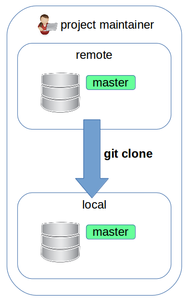

-----

## Forking workflow: developer setup

Il developer ora:

* crea un **fork** remoto del repository upstream

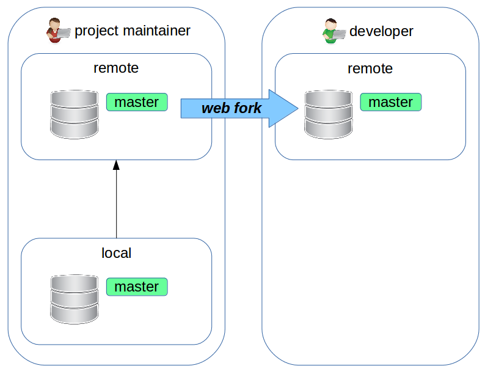

## Bonus track

* un fork altro non è che un clone (--mirror) di un repository, sempre ospitato sul sito remoto

-----

## Forking workflow: developer setup

* fa un **clone** locale del proprio repository remoto

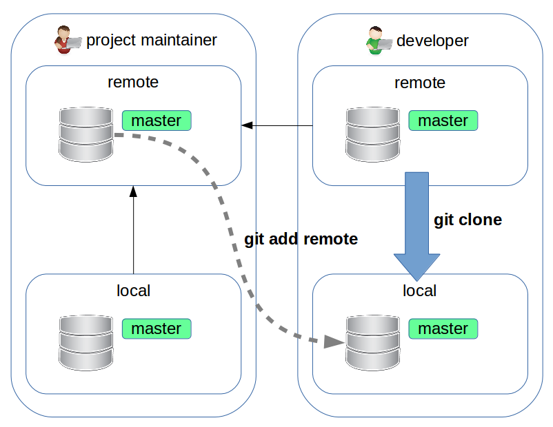

-----

## Forking workflow: iniziamo lo sviluppo

Developer deve sviluppare un fix che andrà applicato sul branch master del repository upstream.

Nel clone locale del *proprio* fork, farà:

    $ git checkout master
    $ git pull upstream

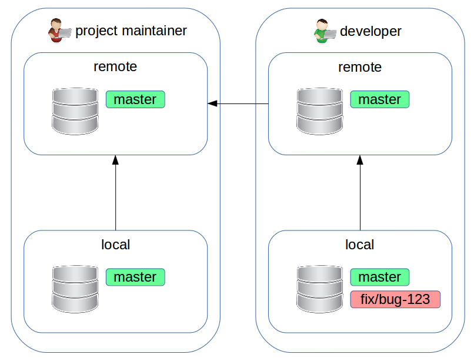

-----

## Forking workflow: nuovo branch

    $ git checkout -b fix/bug-123

-----

## Forking workflow: lavoriamo

    $ # introdurre il fix
    $ git commit
    $ git push --set-upstream origin fix/bug-123

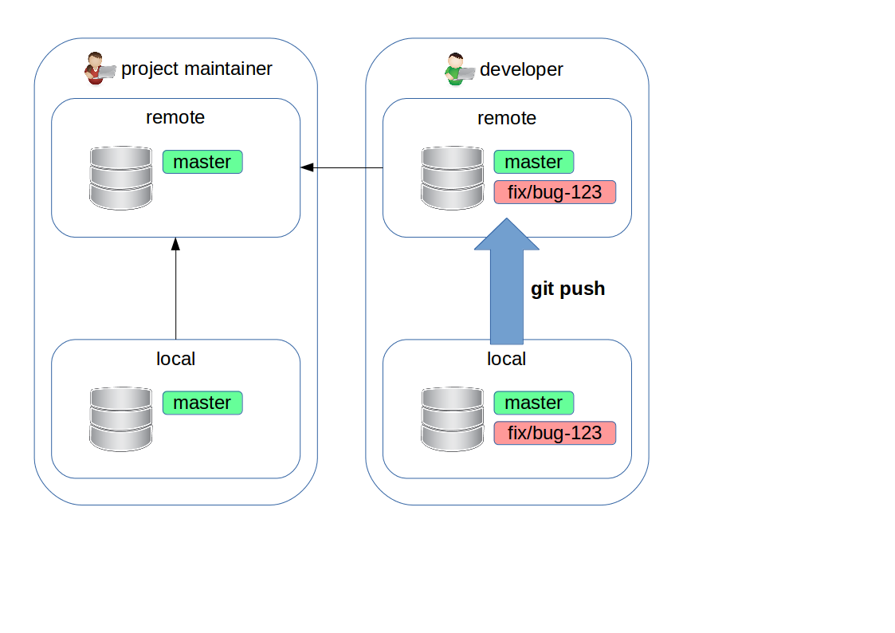

-----

## Forking workflow: pull request

Ora va sulla pagina web del proprio fork e crea una **pull request**.

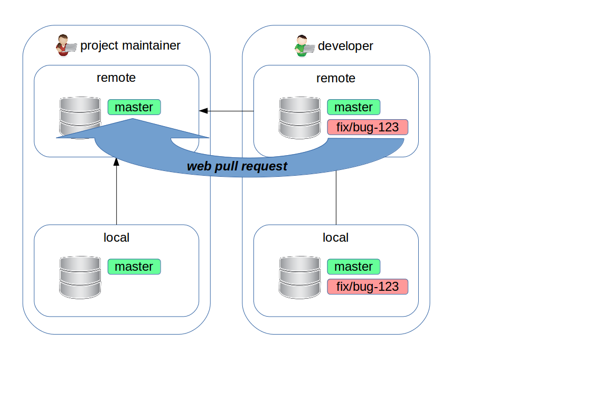

-----

## Forking workflow: pull request

Pull request **NON** è un concetto base di Git (non esattamente, almeno). È qualcosa che vi è stato costruito sopra per facilitare la collaborazione tra sviluppatori.

La pull request creata in precedenza dice: "propongo di applicare i commit del branch *developer-fork:fix/bug-123* a *repository-upstream:master*"
Ora developer, project maintainer e altri possono discuterne.

Se dovesse essere necessario, developer può aggiungere altri commit semplicemente con un nuovo push.

-----

## Forking workflow: merging

Una volta soddisfatti, project maintainer potrà effettuare il merge del codice su *repository-upstream:master*.

Se il merge non presenta conflitti, lo si può fare direttamente dalla GUI web sul repository upstream.  Altrimenti il project maintainer dovrà fare il fetch di developer-fork:fix/bug-123 sul proprio clone locale, effettuare il merge su master per poi farne il push sul repository upstream.

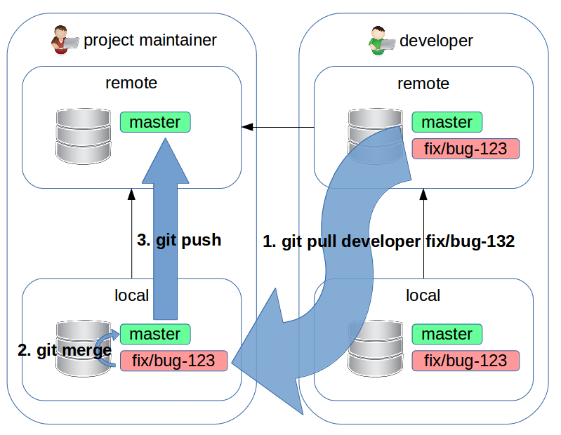

---

## Parte 2

In cui forniremo una serie di strumenti avanzati.

---

## Referenziare i commit

Salire di 3 livelli, seguendo sempre il primo parent commit (in caso di merge):

    $ git log -1 HEAD~3

Salire di un livello, seguendo il secondo parent commit (in caso di merge):

    $ git log -1 HEAD^2

### Bonus track

* cosa è HEAD: reference al branch (o commit) corrente
* **detached HEAD**: ci siamo spostati su un commit che non è l'head di un branch
* questi operatori sono concatenabili: HEAD~~^2

-----

## Referenziare i commit: range

double dot range:

    $ git log master..branch

triple dot range:

    $ git log --left-right master...branch

TODO: disegno

https://stackoverflow.com/questions/7251477/what-are-the-differences-between-double-dot-and-triple-dot-in-git-dif

---

## Rimettere insieme i pezzi: cherry-pick

    $ git cherry-pick <commit>
    $ # in caso di conflitti:
    $ git cherry-pick --continue

TODO: immagine con lo stato corrente

### Cosa è successo?

Si sono prese le modifiche introdotte dai commit elencati, e sono state riapplicate sul branch corrente.
Sono stati creati dei nuovi commit.

 

### Quando usarlo?

Ad esempio per backportare un fix su diversi release branch, o se vi siete accorti che un certo commit era da fare su un altro branch.

---

## Rimettere insieme i pezzi: rebase

Poniamoci nella stessa situazione divergente dell'esempio in cui abbiamo usato merge, e poi:

    $ git checkout fix/bug-123
    $ git rebase master
    $ # risolviamo eventuali conflitti
    $ git rebase --continue

TODO: immagine con lo stato corrente

 

### Cosa è successo?

Abbiamo preso tutti i commit di fix/bug-123 e li abbiamo ri-applicati su master, che nel mentre era andato avanti.

Tutti i commit specifici di fix/bug-123 sono cambiati.

-----

## Rebase

### Quando usarlo?

Quando dovete spostare più commit e/o per porvi nella condizione di fare un merge pulito. Questo può essere fatto dal developer prima di aprire una pull request per semplificare il lavoro al maintainer e/o dal maintainer stesso prima del merge, per ottenere una history lineare.

 

### Quando NON usarlo?

Un rebase modifica i commit originali: questo va evitato se quei commit sono già stati pushati ed altri sviluppatori li stanno usando come base per il proprio lavoro.

---

## Modificare la history

Creiamo un nuovo branch e committiamo 2 o 3 modifiche.  Poi:

    $ git rebase -i master

TODO: immagine con lo stato corrente

 

### Cosa è successo?

Abbiamo accorpato, scartato o invertito l'ordine dei commit.

 

### Bonus track

* l'opzione nucleare: **filter-branch** per creare script che riscrivono la history.

---

## Lavoro incompleto: committare a pezzi

* git add --patch

---

## Mettere il lavoro da parte: stash

Capita di dover mettere da parte il lavoro nella directory corrente senza voler committare:

    $ git stash

Vedere la lista:

    $ git stash list

Riapplicare una modifica messa in stash:

    $ git stash pop [stash]

Eliminarne uno:

    $ git stash drop stash@{0}

## Quando usarlo?

Ad esempio quando vogliamo passare ad un altro branch, accantonando le modifiche nella working directory.

---

## Creare e applicare patch

è possibile creare e riapplicare una patch usando i comandi:

    $ git format-patch [refs]
    $ git apply patch-file.diff

---

## Storico dei cambiamenti: reflog

La history mostra solo i commit inclusi in un branch.

Per vedere tutto ciò che è successo:

    $ git reflog [--relative-date]

 

### Quando usarlo?

* a volte è utile capire come ci siamo mossi tra i branch
* fondamentale per recuperare i **broken commits** (non referenziati da alcun branch)

---

## Idee sparse

* gestire file grandi: https://git-lfs.github.com/
* gestire file grandi (alternativa): https://git-annex.branchable.com/
* gestire la propria directory /etc: etckeeper
* gestire repository multipli: https://source.android.com/source/using-repo

-----

## Pezzi mancanti

* git submodule
* git bisect
* git gui; gitk

---

## Risorse

### Per imparare

* Pro Git: https://git-scm.com/book/en/
* Reference: https://git-scm.com/docs
* Learn Git Branching: http://learngitbranching.js.org/
* Git ready: http://gitready.com/
* Git Cookbook: https://git.seveas.net/
* tutorial di Atlassian: https://www.atlassian.com/git/tutorials

 

### Utilità

* bash prompt: https://github.com/magicmonty/bash-git-prompt
* Meld: http://meldmerge.org/

---

## The end

 

## ?

 
 
## Davide Alberani <da@erlug.linux.it>
