# Git crash course

## Davide Alberani <da@mimante.net> 2017-2026

 
Non-corso per non prendere a martellate il monitor quando usate Git.

 
 

**git clone https://git.lattuga.net/alberanid/git-crash-course.git**

 
 
This work is licensed under the Creative Commons Attribution-ShareAlike 4.0 International License: http://creativecommons.org/licenses/by-sa/4.0/

---

## A chi è rivolto

A chi si trova a volere/dovere usare Git in un piccolo team, ed è ancora alle prime armi.

-----

## Struttura del corso

### Parte 1

Le basi per lavorare in locale e con repository remoti.

### Parte 2

Un workflow per lo sviluppo collaborativo, da applicare senza porsi troppe domande.

### Parte 3

Una serie di strumenti avanzati, per chi ci ha preso gusto e vuole approfondire lo strumento.

-----

## Cosa verrà trattato

* i comandi essenziali da riga di comando. Noti come **porcelain** ("ceramica"), sono comandi user-friendly di alto livello, contrapposti agli elementi *plumbing* ("tubature") di basso livello

* come gestire i branch

* le basi per lavorare con repository remoti

* un workflow per collaborare con altri sviluppatori

-----

## Cosa NON verrà trattato

* gli internals (**plumbing**) di Git
* *GitHub* (sorry, è solo un servizio di hosting)
* le GUI
* amministrazione di un repository remoto
* flame wars (discussioni) sui tipi di workflow

-----

## Cosa è Git

Un sistema di controllo versione distribuito.

Serve per tener traccia dei cambiamenti al proprio codice e per facilitare lo sviluppo condiviso. Va ricordato che Git è nato soprattutto per aiutare chi deve integrare il codice altrui, e questo si riflette sulla sua logica.

 
Il resto <a href="https://en.wikipedia.org/wiki/Git_(software)">lo spiega meglio Wikipedia</a>.

-----

## Cosa NON è Git

* non è Subversion o CVS
* non è un sistema di backup
* non è un sistema per [fare deploy](https://grimoire.ca/git/stop-using-git-pull-to-deploy) (o magari sì, ma rifletteteci)

-----

## Si dice in giro

*Git non avrà segreti per voi, una volta compreso...*

* ...il data model (objects, blobs, trees, commits, refs, tags, ...)
* ...il fatto che quasi tutte le operazioni sono locali (fetch, pull e push comunicano con altri repository)
* ...che i commit sono in realtà snapshot, e non delta rispetto allo stato precedente
* ...una qualche astrusa teoria a caso

 

### Onestamente?

Tutto vero, ma la sua user interface è un mezzo disastro.

---

## Le basi: definizioni

* **Working directory**: i file su cui state lavorando

* **Staging area** (o **Index**): dove mettiamo da parte le modifiche che finiranno nel prossimo commit

* **Commit**: snapshot dei file versionati, con metadati e riferimenti ai commit genitori

* (fare) **Checkout**: aggiornare i file nella working directory ad un dato branch/commit/...

* **HEAD**: riferimento alla posizione corrente nella storia; di norma punta al branch corrente, che punta a un commit

* **refs**: riferimenti con un nome, come branch e tag; HEAD è un riferimento speciale

-----

## Le basi: prepariamo l'ambiente con git config

    $ git config --global user.name "Davide Alberani"
    $ git config --global user.email da@mimante.net
    $ git config --global color.ui auto

Nome ed email identificano l’autore dei commit: non sono credenziali di accesso. Usate i vostri dati.

I principali file di configurazione, in ordine di precedenza crescente:
* **/etc/gitconfig** (il percorso dipende dall’installazione): opzioni di sistema, valide per tutti gli utenti
* **~/.config/git/config**, poi **~/.gitconfig**: opzioni valide per l’utente corrente; se esistono entrambi, Git li legge entrambi
* **.git/config** nel repository corrente: opzioni locali valide solo per il repository corrente

 

### Bonus track

* cercare un esempio di ~/.gitconfig avanzato, con qualche alias per i comandi principali, come [questo](https://github.com/alberanid/git-config/blob/master/gitconfig) o [quest'altro](https://gist.github.com/pksunkara/988716)

-----

### Le basi: alcune opzioni di configurazione

Alias comuni:

    $ git config --global alias.st status
    $ git config --global alias.br branch
    $ git config --global alias.co checkout

Colori:

    $ git config --global color.branch.current "yellow bold"
    $ git config --global color.branch.local "green bold"
    $ git config --global color.branch.remote "cyan bold"
    $ git config --global color.status.added "green bold"

Verificare valori e file di provenienza:

    $ git config --list --show-origin

---

## Parte 1

In cui forniamo le basi per lavorare in locale e con repository remoti.

---

## Le basi: creare un repository

Creare un nuovo repository partendo da una directory (vuota o meno):

    $ git init -b main

Negli esempi usiamo **main** come branch principale; i repository più vecchi possono usare **master**. L’opzione **-b** richiede Git 2.28 o successivo.

Clonare un repository remoto esistente:

    $ git clone https://git.lattuga.net/user/repo.git
    $ cd repo

-----

## creare un repository: cosa è successo?

È stata creata la directory **.git** (il **repository**); se abbiamo fatto un clone, è stato aggiunto il riferimento al remote "*origin*".

 

### Bonus track

* i repository remoti, in cui non si lavora direttamente ma ricevono push e forniscono dati ai fetch, vengono di norma creati con **--bare** e non hanno working directory. Sono repo usati per **condividere**. Gli sviluppatori clonano il *shared bare repo*, fanno modifiche locali nelle loro working repo e fanno push nel *shared bare repo* per rendere le modifiche disponibili agli altri. Siccome nessuno edita direttamente nel *shared bare repo*, non serve avere un working tree. Anzi, questo potrebbe essere causa di conflitto.

-----

<!-- .slide: class="two-cols" -->

## Le basi: status

Vedere lo stato del repository (usatelo spesso! un utile [cheatsheet](https://ndpsoftware.com/git-cheatsheet.html)):

    $ git status [-s]

Negli esempi **$** è il prompt: non va digitato. Le **[parentesi quadre]** indicano parti facoltative; i **`<segnaposto>`** vanno sostituiti.

 

### Stati dei file

* **Untracked**: nuovi file nella working directory, non ancora aggiunti

* **Unmodified**: file che non sono cambiati dal commit precedente

* **Modified**: modificati nella working area e non ancora aggiunti alla staging area

* **Staged**: nella staging area, pronti per il prossimo commit

Un file può avere sia modifiche staged sia modifiche non staged.

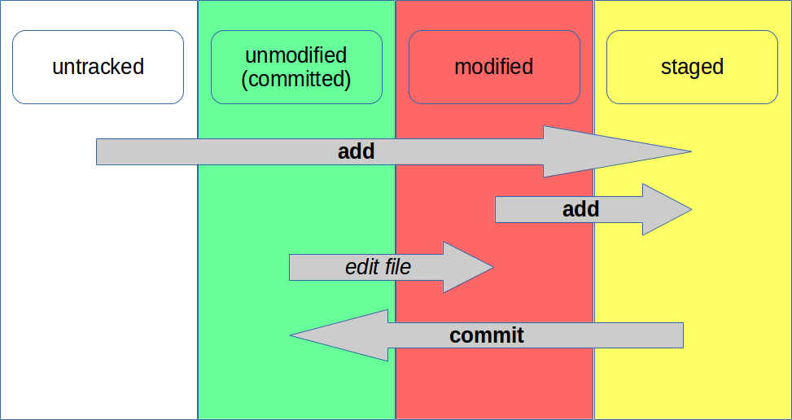

---

## Le basi: add e commit

Modifichiamo un file ed aggiungiamolo alla staging area:

    $ git add prova.txt

**git add** prepara il contenuto attuale del file: se lo modificate ancora, ripetete add per includere anche le nuove modifiche.

Creiamo il commit:

    $ git commit [-m "messaggio di commit"]

Il commit salva la staging area in locale. Senza **-m** si apre l’editor per il messaggio.

Verifichiamo quanto accaduto:

    $ git log

-----

## add e commit: cosa è successo?

Abbiamo aggiunto un file alla staging area, per poi salvare uno snapshot del nostro lavoro. Se - come normalmente accade - siamo in un branch, questo punta al nuovo commit (HEAD continua a puntare al branch, e di conseguenza anch'essa al nuovo commit).

 

### Bonus track

* indovinate cosa fanno **git rm** e **git mv**
* [committate spesso](https://sethrobertson.github.io/GitBestPractices/)
* come scrivere un messaggio di commit [che non susciti sgomento](https://chris.beams.io/posts/git-commit/)? Issue, titolo breve, descrizione estesa
* non salva directory vuote; se servono, aggiungete un file *.gitkeep* (è solo una convenzione)
* creare un file **.gitignore** per escludere file non tracciati: non smette di versionare quelli già tracciati

-----

## Cosa sono i commit

Sono uno snapshot dei file versionati presenti nella staging area in un dato momento, **identificati da un hash** (e.g.: *6d7696a8b894c8ef039d6fd2ecdc514a2efe16b5*).

L’hash dipende dal contenuto del commit: messaggio, autore, committer, date, albero dei file e hash dei genitori (nessuno per il commit iniziale, più di uno per un merge).

 

### Bonus track

* è possibile abbreviare gli hash, purché rimangano univoci (e.g. *6d769*)
* per dettagli, vedere [anatomy of a Git commit](https://blog.thoughtram.io/git/2014/11/18/the-anatomy-of-a-git-commit.html) e [Git Internals](https://git-scm.com/book/it/v2/Git-Internals-Git-References)

-----

## Le basi: la history

    $ git log [--stat] [--patch] [--graph] [--decorate] [--color] [-2]

Mostra i commit raggiungibili da HEAD (o dai riferimenti indicati), seguendo i genitori. Con **--all** include tutti i branch e gli altri riferimenti.

Si può limitare agli ultimi N commit con ***-N***

 

### Bonus track

* visualizzare solo i commit che hanno coinvolto un dato file: **git log -- file.txt**
* per avere informazioni su un singolo commit, si può anche usare **git show**
* per visualizzare quali commit hanno influenzato le singole righe di un file (e vedere chi le ha editate): **git blame file.txt**

-----

## Le basi: diff

Confrontare la working directory con la staging area (esclusi i file untracked):

    $ git diff

Confrontare la staging area con l’ultimo commit (**ciò che finirà nel prossimo commit**):

    $ git diff --staged

-----

## Le basi: tag

Un tag è un puntatore ad un commit:

    $ git tag -a v1.0

 

### Bonus track

* esistono sia i tag *lightweight* che *annotated*. La differenza principale è che i primi sono solo dei puntatori, i secondi sono oggetti completi: hanno autore del tag, data e messaggio, e possono essere firmati. A differenza dei branch, i tag non avanzano con i nuovi commit.

---

## Aggiustare i danni

Modificare l'ultimo commit (cambiare il commit message o l'autore, oppure modificare un file - in questo caso va prima modificato nella working directory e fatto *git add*):

    $ git commit --amend [--author="Name Surname <user@example.com>"]

Togliere un file dalla staging area, mantenendo le modifiche nella working directory:

    $ git reset HEAD -- file

Sovrascrivere un file nella working directory con la versione nella staging area (**perde le modifiche non staged**):

    $ git checkout -- file

### Bonus track

* **--amend** sostituisce l’ultimo commit con uno nuovo: evitatelo sui commit già condivisi
* **git clean -n** mostra i file untracked che **git clean -f** eliminerebbe definitivamente; senza **-d** non rimuove le directory untracked, e i file ignorati sono esclusi

-----

## Aggiustare i danni: più forte

Ho fatto un casino nella working directory.  Riportiamo tutto allo stato dell'ultimo commit:

    $ git reset --hard HEAD

**Perde le modifiche non committate ai file tracciati**, anche staged. Può eliminare file untracked che impediscono il ripristino; non è una pulizia generale degli untracked.

Voglio creare un nuovo commit che annulla le modifiche introdotte da un commit precedente:

    $ git revert [-n] <commit>

Con **-n** prepara l’annullamento senza creare il commit. In caso di conflitti: risolvere, fare **git add**, poi **git revert --continue**; per annullare: **git revert --abort**.

 

### Bonus track

* maggiori [informazioni sul reset](https://stackoverflow.com/questions/3528245/whats-the-difference-between-git-reset-mixed-soft-and-hard)
* workflow [per risolvere problemi](http://justinhileman.info/article/git-pretty/git-pretty.png)
* [qualche comando utile](http://ohshitgit.com/) per risolvere i guai fatti

---

## Branches: cosa sono e perché usarli?

Sono puntatori mobili a commit: a ogni nuovo commit avanza il branch corrente.

Servono a separare diversi filoni di sviluppo e ad integrare i contributi di altri.

-----

## Branches: creazione

Creare un branch:

    $ git branch fix/bug-123

Visualizzare i branch locali (**-a** include anche i riferimenti remoti):

    $ git branch [-a] [-v]

Cancellare un branch locale:

    $ git branch -d fix/bug-123

Spostatevi prima su un altro branch. **-d** verifica che il lavoro sia integrato nell’upstream configurato (o in HEAD, se manca); **-D** forza la cancellazione e può far perdere il riferimento a lavoro non integrato.

-----

## Branches: spostiamoci

Spostarsi su un branch:

    $ git checkout fix/bug-123

Creare e spostarsi in un singolo comando (può essere usato solo se il branch non esiste ancora):

    $ git checkout -b fix/bug-123

 

### Bonus track

* nello spostarsi, Git cerca di mantenere i cambiamenti presenti nella working directory e nella staging area

-----

## Branches: approfondiamo

* **main** e **master** sono nomi convenzionali: il branch principale e la sua stabilità dipendono dal progetto

* dare [nomi significativi](http://www.guyroutledge.co.uk/blog/git-branch-naming-conventions/); usate prefissi come *bugfix/*, *fix/*, *improvement/*, *feature/*, *task/* e issue di riferimento

* prendete l'abitudine, **tutte** le volte che sviluppate un fix o una nuova feature, di farlo in un nuovo branch (che di norma partirà da *main*)

* possono essere logicamente suddivise: *feature* (o *topic*), *release*, *integration* branches e così via

---

## Rimettere insieme i pezzi: merge

    $ git checkout -b fix/bug-123
    $ # editiamo nuovofile.txt
    $ git add nuovofile.txt
    $ git commit

    $ git checkout main
    $ git merge fix/bug-123

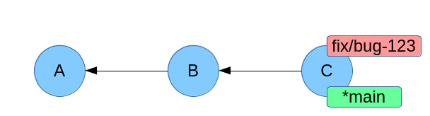

-----

## Merge: cosa è successo?

**fast-forward**!

main era più indietro rispetto a fix/bug-123, e quindi abbiamo semplicemente spostato il puntatore main. Non è stato neppure creato un nuovo commit.

Il comando **git merge** offre **--ff-only** (rifiuta il merge se serve un commit di merge) e **--no-ff** (crea un commit di merge anche quando sarebbe possibile un fast-forward).

-----

## Risoluzione dei conflitti

    $ git branch fix/bug-123
    $ git checkout fix/bug-123
    $ # editiamo file.txt
    $ git add file.txt
    $ git commit

    $ git checkout main
    $ # editiamo file.txt in maniera differente, sulle stesse righe
    $ git add file.txt
    $ git commit

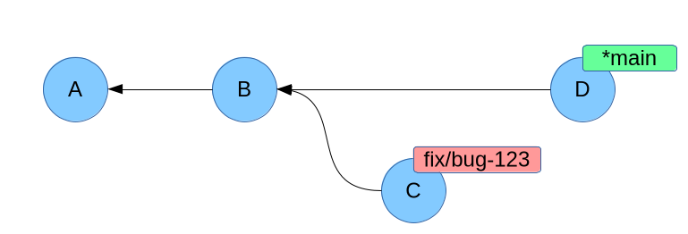

### Bonus track

* quali commit fanno parte del branch fix/bug-123 e quali di main?

-----

## Risoluzione dei conflitti

Mergiamo:

    $ git merge fix/bug-123
    $ # risolviamo i conflitti
    $ git add file.txt
    $ git commit

### Bonus track

* che succede al commit *C* se cancelliamo fix/bug-123?

-----

## File in conflitto

Usate **git status** per elencare i conflitti. Nei conflitti di contenuto, scegliete il risultato corretto e rimuovete i marcatori **<<<<<<<**, **=======**, **>>>>>>>**; poi **git add** e **git commit**.

Non tutti i conflitti hanno marcatori (ad esempio file eliminati o binari). Per annullare il merge: **git merge --abort**. Iniziate con working directory e staging area pulite.

 

### Bonus track

* potete usare **meld** come GUI per risolvere i conflitti

---

## Lavorare con repository remoti

    $ git remote add origin https://git.lattuga.net/user/repo.git
    $ git remote -v

 

### Bonus track

* **origin** è il nome convenzionale assegnato da clone; se esiste già, non ripetete **git remote add origin**
* dopo il fetch, **git checkout --track origin/fix/bug-123** crea un branch locale collegato a quello remoto; **git checkout origin/fix/bug-123** porta invece in *detached HEAD*

-----

## Fetch & pull

Scaricare dati e aggiornare i riferimenti remoti locali, senza modificare il branch corrente o i file di lavoro:

    $ git fetch --prune origin

Commit che divergono tra il main locale e quello remoto:

    $ git log --left-right main...origin/main

Scaricare gli aggiornamenti e integrare origin/main nel branch corrente (qui assumiamo di essere su main):

    $ git pull --no-rebase origin main

 

### Bonus track

* **git pull** esegue fetch e poi integra: **--no-rebase** usa merge, **--rebase** usa rebase, **--ff-only** accetta solo fast-forward; senza opzioni il comportamento dipende anche dalla configurazione
* **--prune** elimina i riferimenti remoti locali ai branch cancellati sul server, non i vostri branch locali

-----

## Branches locali e remoti

* **local branch**: un riferimento locale su cui lavorate, che può avere un corrispondente sul remoto

* **remote branch**: un branch che esiste su un repository remoto

* **remote tracking branch**: la copia locale di un remote branch; aggiornabile con fetch, non è possibile lavorarci sopra direttamente

* **local tracking branch**: un branch locale su cui è possibile lavorare direttamente, che traccia un altro branch (di norma, un remote tracking branch)

* se *branch-1* non esiste in locale e un solo remoto ha quel nome, **git checkout branch-1** normalmente crea il branch locale con upstream **origin/branch-1**. Forma esplicita: **git checkout --track origin/branch-1**

-----

## Push

Aggiungere al repository remoto un branch locale:

    $ git push --set-upstream origin local-branch-name

Inviare i cambiamenti locali ad un branch remoto:

    $ git push [--tags] [origin [main]]

 

### Bonus track

* git push di default non invia i tags, che vanno pushati separatamente aggiungendo --tags
* cancellare un branch remoto: **git push --delete origin branch-name**

-----

## Parlando della history remota...

Cosa da non fare **MAI** (salvo non ne siate davvero convinti): modificare una history che sia già stata pushata.

Questo perché se qualcuno sta lavorando sullo stesso branch remoto, le altre persone si troveranno con dei repository non coerenti.

---

## Parte 2

In cui forniamo un workflow precotto per chi non vuole porsi troppe domande, adatto allo sviluppo collaborativo.

---

## Quale workflow?

Nello scegliere un workflow dovrete rispondere ad alcune domande, quali:

* chi parteciperà allo sviluppo? Vengono accettati contributi da esterni o solo da un gruppo ristretto?
* qual è il mio modello di rilascio del software? Ho versioni multiple da manutenere? A partire da quanti/quali branch verranno rilasciate le nuove versioni del mio software?
* chi si occuperà dell'integrazione? Gli sviluppatori stessi o una figura dedicata?

-----

<!-- .slide: class="align-left" -->

## Workflow: le alternative

I principali sono:

* centralized
* feature branch
* gitflow
* forking
* qualcosa tenuto insieme con gli elastici

Valide risorse:

* https://www.atlassian.com/git/tutorials/comparing-workflows
* https://guides.github.com/introduction/flow/

---

## Forking workflow

Vediamo il **forking workflow**. Non perché sia intrinsecamente il migliore, ma perché è comune nei contributi a progetti su piattaforme come GitHub. Presupposti:

* esiste un repository ufficiale (che, dal punto di vista di un developer, chiameremo **upstream**) di riferimento su cui solo gli autori principali possono scrivere
* ruolo di **project maintainer**: la persona che si occuperà di mergiare nel repository upstream
* ruolo di **developer**: chi sta sviluppando un fix o una nuova feature
* ciascun developer avrà un fork remoto del repository upstream ed una copia locale su cui lavorare

-----

## Forking workflow: maintainer setup

Il project maintainer ha creato il repository upstream remoto e il proprio clone locale.

    $ git clone https://git.lattuga.net/maintainer/repo.git

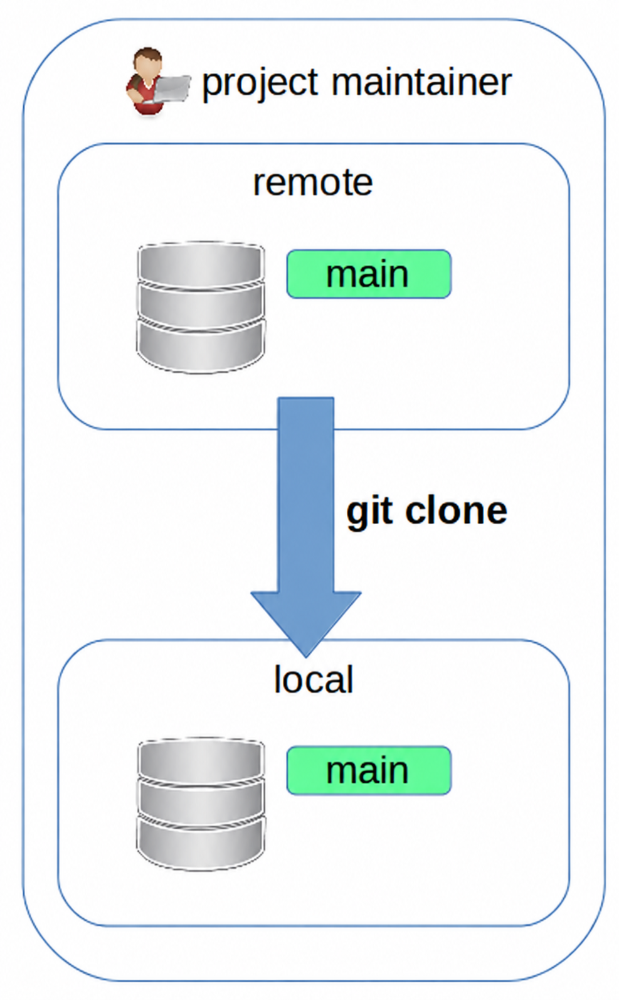

-----

## Forking workflow: developer setup

Il developer ora:

* crea un **fork** remoto del repository upstream

### Bonus track

* un fork è una copia del repository sul servizio di hosting, collegata al progetto originale dalla piattaforma; non è un comando Git né equivale necessariamente a **clone --mirror**

-----

## Forking workflow: developer setup

Developer fa un **clone** locale del proprio repository remoto. È una buona idea aggiungere un remote "**upstream**" che punti al repository del maintainer:

    $ git clone https://git.lattuga.net/developer/repo.git
    $ cd repo
    $ git remote add upstream https://git.lattuga.net/maintainer/repo.git

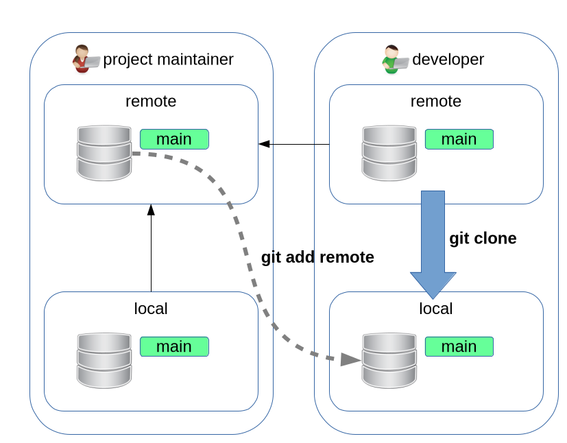

-----

## Forking workflow: iniziamo lo sviluppo

Developer deve sviluppare un fix che andrà applicato sul branch main del repository upstream.

Prima di tutto è opportuno sincronizzare il proprio branch main con quello upstream, in modo da lavorare su codice recente:

    $ git checkout main
    $ git pull --ff-only upstream main

-----

## Forking workflow: nuovo branch

    $ git checkout -b fix/bug-123

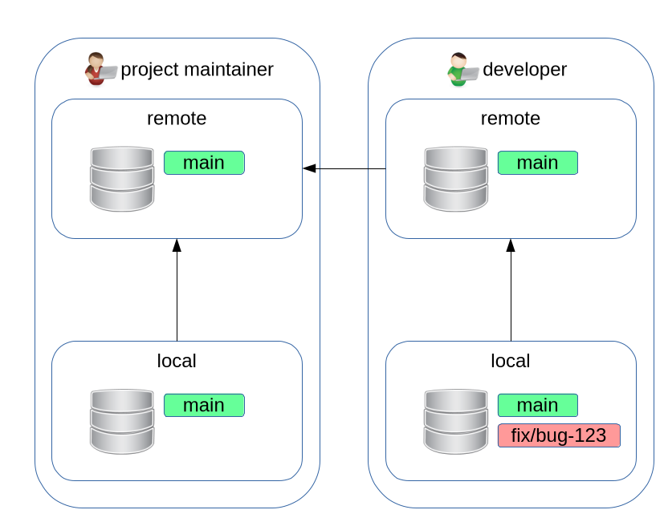

### Bonus track

* in questo workflow lasciate *main* senza commit propri: così l’aggiornamento da *upstream* resta un fast-forward. Se i branch divergono, **--ff-only** si ferma e occorre riconciliarli

-----

## Forking workflow: lavoriamo

    $ # introdurre il fix
    $ git add file.txt
    $ git commit
    $ git push --set-upstream origin fix/bug-123

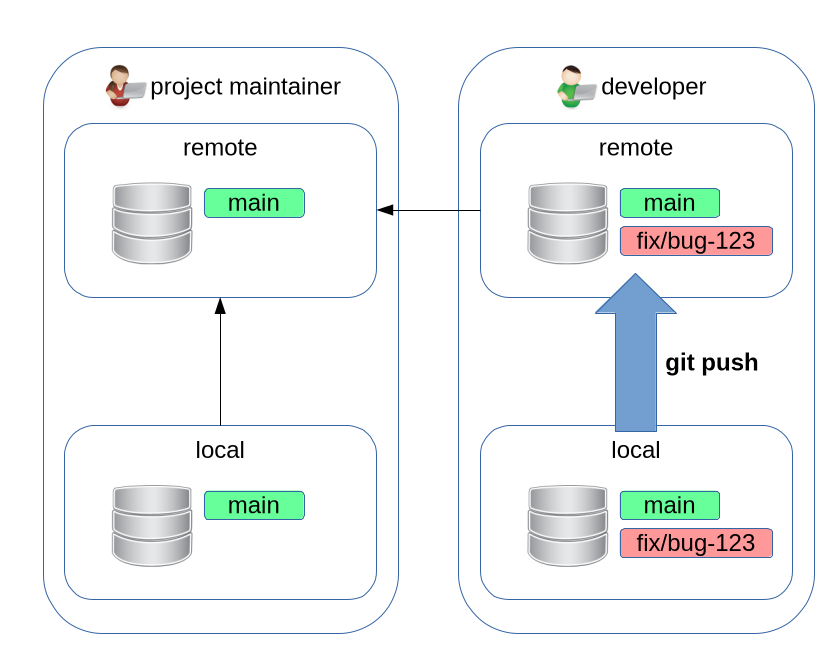

-----

## Forking workflow: pull request

Ora va sulla pagina web del proprio fork e crea una **pull request**.

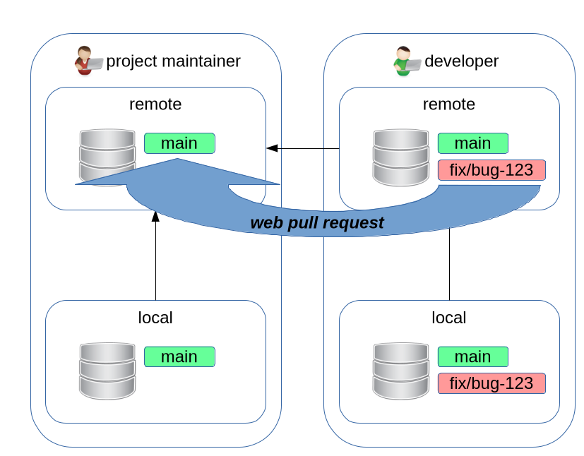

### Bonus track

* se il progetto lo richiede, aggiornate **upstream/main** con **git fetch upstream**, poi fate rebase del feature branch. Se già pubblicato, coordinatevi con chi lo usa: servirà **git push --force-with-lease**, che rifiuta l’aggiornamento se il remoto non corrisponde al valore atteso

-----

## Forking workflow: pull request

Pull request **NON** è un concetto base di Git (non esattamente, almeno). È qualcosa che vi è stato costruito sopra per facilitare la collaborazione tra sviluppatori.

La pull request creata in precedenza dice: "propongo di applicare i commit del branch *developer:fix/bug-123* a *maintainer:main*"
Ora developer, project maintainer e altri possono discuterne.

Se dovesse essere necessario, developer o altri utenti autorizzati possono aggiungere altri commit semplicemente con un nuovo push.

-----

## Forking workflow: merging

Una volta soddisfatti, project maintainer potrà effettuare il merge del codice su *maintainer:main*.

**Se il merge non presenta conflitti**, lo farà direttamente dalla GUI web sul repository upstream.

In caso di conflitti, può chiedere al developer di risolverli sul proprio branch, oppure aggiungere un remote che punti al repository di *developer*, fare il fetch di *developer:fix/bug-123*, effettuare il merge su main per poi farne il push sul repository upstream.

-----

<!-- .slide: class="align-left" -->

## Forking workflow: senza aggiungere un remote

Si può integrare un topic branch direttamente dal suo URL. È utile se ricevete contributi occasionali; per collaborazioni ricorrenti può essere comodo aggiungere un remote.

Nel caso di GitHub, ad esempio:

1. git checkout -b developer/bug-123 main
1. git pull --no-rebase https://github.com/developer/repo.git fix/bug-123
1. risolvere eventuali conflitti, poi **git add file.txt** e **git commit**
1. git checkout main
1. git merge --no-ff developer/bug-123
1. git push origin main

-----

## Forking workflow: sunto setup maintainer

1. clone locale: **git clone https://git.lattuga.net/maintainer/repo.git**

-----

## Forking workflow: sunto setup developer

1. fork sul web
1. clone locale del fork: **git clone https://git.lattuga.net/developer/repo.git**
1. entra nel clone: **cd repo**
1. aggiunge un remote che punta al repository upstream: **git remote add upstream https://git.lattuga.net/maintainer/repo.git**

-----

## Forking workflow: sunto sviluppo developer

1. aggiorna il proprio main: **git checkout main ; git pull --ff-only upstream main**
1. crea un branch su cui lavorare: **git checkout -b fix/bug-123**
1. modifica i file, poi: **git add file.txt** e **git commit**
1. opzionalmente, aggiorna e fa il rebase: **git fetch upstream**, poi **git rebase upstream/main**
1. invia le modifiche al proprio repository remoto: **git push --set-upstream origin fix/bug-123**
1. crea sul web una pull request
1. se serve, integra il lavoro semplicemente pushando altri commit fatti su fix/bug-123

-----

<!-- .slide: class="align-left" -->

## Forking workflow: sunto lavoro del maintainer

1. riceve una pull request e la valuta.
1. se mergiabile senza conflitti, lo fa via web.

*Altrimenti:*

1. se non lo ha già fatto, aggiunge un remote per il repository del developer: **git remote add developer https://git.lattuga.net/developer/repo.git**
1. scarica i branch del developer: **git fetch developer**
1. si sposta su main: **git checkout main**
1. avvia il merge: **git merge --no-ff developer/fix/bug-123**
1. se ci sono conflitti, li risolve, poi **git add file.txt** e **git commit**
1. invia il main al proprio repository remoto: **git push origin main**

---

## Parte 3

In cui forniremo una serie di strumenti avanzati.

---

## Referenziare i commit

Salire di 3 livelli, seguendo sempre il primo parent commit (in caso di merge):

    $ git show -s HEAD~3

Salire di un livello, seguendo il secondo parent commit (in caso di merge):

    $ git show -s HEAD^2

### Bonus track

* **detached HEAD**: HEAD punta direttamente a un commit anziché a un branch; per conservare nuovi commit, create un branch con **git checkout -b nome**
* questi operatori sono concatenabili: HEAD~~^2

-----

## Referenziare i commit: range

**Double dot range**. Usando *diff* mostra i cambiamenti tra "main" e "branch"; usando *log* mostra i commit raggiungibili da "branch" ma non da "main":

    $ git diff main..branch

 

**Triple dot range**. Usando *diff* mostra la differenza tra il punto di biforcazione tra "main" e "branch" e "branch" stesso; usando *log* mostra i commit raggiungibili da "main" o "branch", ma non da entrambi:

    $ git log --left-right main...branch

-----

## Referenziare i commit: range

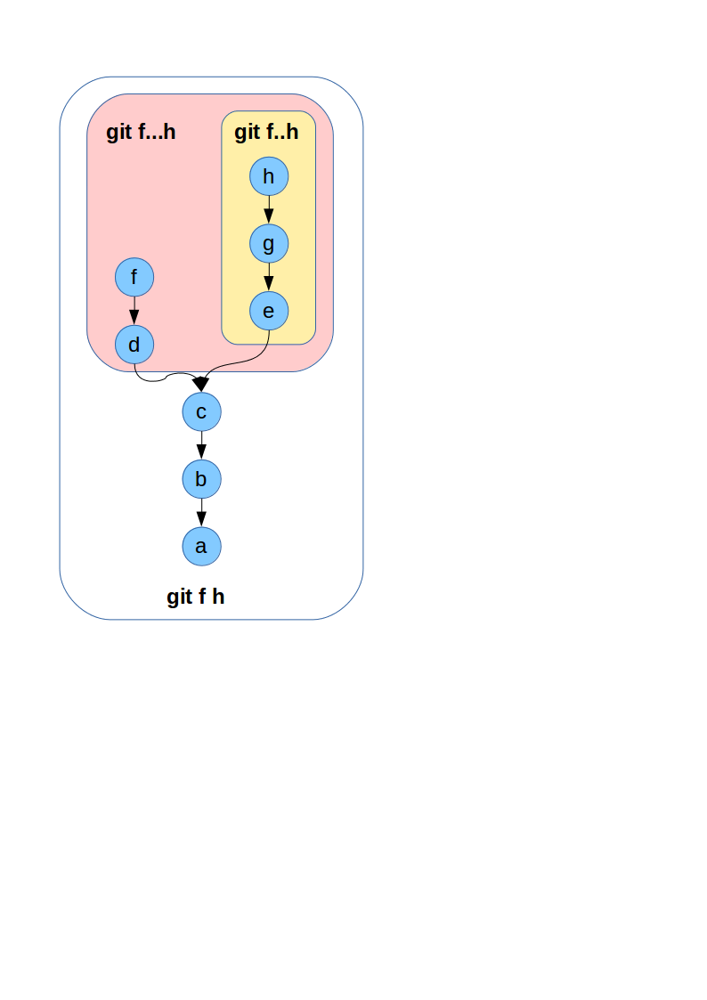
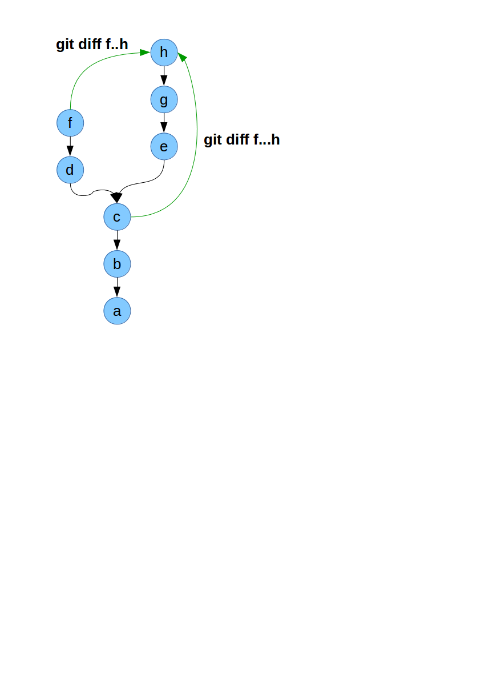

Vedere anche [questa spiegazione](https://stackoverflow.com/questions/7251477/what-are-the-differences-between-double-dot-and-triple-dot-in-git-dif)

---

## Rimettere insieme i pezzi: cherry-pick

    $ git checkout main
    $ git cherry-pick <commit>
    $ # solo in caso di conflitti: risolviamoli nei file
    $ git add file.txt
    $ git cherry-pick --continue

Per annullare l’operazione in corso: **git cherry-pick --abort**.

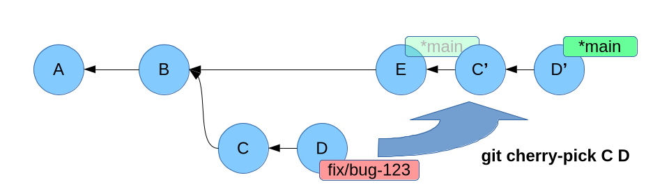

-----

## cherry-pick: cosa è successo?

Si sono prese le modifiche introdotte dai commit elencati, e sono state riapplicate sul branch corrente.
Sono stati creati dei nuovi commit.

 

### Quando usarlo?

Ad esempio per backportare un fix su diversi release branch, o se vi siete accorti che un certo commit era da fare su un altro branch.

---

## Rimettere insieme i pezzi: rebase

Poniamoci nella stessa situazione divergente dell'esempio in cui abbiamo usato merge, e poi:

    $ git checkout fix/bug-123
    $ git rebase main
    $ # solo in caso di conflitti: risolviamoli nei file
    $ git add file.txt
    $ git rebase --continue

Ripetete se altri commit producono conflitti. Per annullare: **git rebase --abort**.

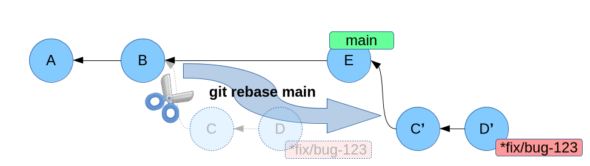

### Cosa è successo?

Nell’esempio, i commit esclusivi di fix/bug-123 sono stati riapplicati a partire da main e hanno nuovi hash. Il branch main non si è spostato: tornando su main, ora possiamo integrarlo con **git merge --ff-only fix/bug-123**.

-----

## Rebase: quando usarlo?

Quando dovete spostare più commit e/o per porvi nella condizione di fare un merge pulito. Questo può essere fatto dal developer prima di aprire una pull request per semplificare il lavoro al maintainer e/o dal maintainer stesso prima del merge, per ottenere una history lineare.

 

### Quando NON usarlo?

Un rebase modifica i commit originali del branch: questo va evitato se quei commit sono già stati pushati ed altri sviluppatori li stanno usando come base per il proprio lavoro.

---

## Modificare la history: rebase interactive

Creiamo un nuovo branch e committiamo 2 o 3 modifiche.  Poi:

    $ git rebase -i main

-----

### Rebase interactive: cosa è successo?

Abbiamo accorpato, scartato o invertito l'ordine dei commit.

È particolarmente utile quando abbiamo finito di lavorare su un branch, e vogliamo semplificare la history accorpando molti commit in uno solo.

 

### Bonus track

* per riscritture estese, la documentazione Git sconsiglia **filter-branch** e rimanda a **git-filter-repo** (strumento esterno).

---

## Lavoro incompleto: committare a pezzi

Editiamo un file in vari punti, e poi aggiungiamolo alla staging area con --patch:

    $ git add --patch

 

### Quando usarlo?

Ad esempio quando non si vuole includere in un commit una riga di debug, che però si vuole mantenere nella working directory.

-----

## Creare e applicare patch

Per esportare l’ultimo commit come patch, con autore e messaggio:

    $ git format-patch -1 HEAD --stdout > modifica.patch

Per applicarla creando un commit con autore e messaggio originali:

    $ git am modifica.patch

Per sole modifiche non staged: **git diff > modifica.diff**, poi **git apply modifica.diff**. Quest’ultimo modifica i file senza creare commit.

-----

## Mettere il lavoro da parte: stash

Accantonare le modifiche ai file tracciati, incluse quelle staged, e mostrare gli stash. Per includere gli untracked usate **git stash -u** (i file ignorati restano esclusi):

    $ git stash
    $ git stash list

Riapplicare uno stash e, dopo aver verificato il risultato, eliminarlo (**stash pop** fa entrambe le cose, ma conserva lo stash se ci sono conflitti):

    $ git stash apply stash@{0}
    $ git stash drop stash@{0}

### Quando usarlo?

Ad esempio quando vogliamo passare ad un altro branch, accantonando le modifiche nella working directory.

-----

## Storico dei cambiamenti: reflog

**git log** segue i genitori dei commit dai riferimenti scelti. Il **reflog** registra invece gli aggiornamenti locali dei riferimenti, inclusi gli spostamenti di HEAD:

    $ git reflog
    $ git show "HEAD@{2 weeks ago}"

È locale, non viene trasferito con push o clone e le sue voci scadono: non garantisce un recupero permanente.

 

### Quando usarlo?

* a volte è utile capire come ci siamo mossi tra i branch
* per recuperare un commit non più raggiungibile da un branch: individuate l’hash nel reflog, poi **`git branch recupero <hash>`**; non recupera modifiche mai salvate in Git

---

## Idee sparse

* gestire file grandi: https://git-lfs.github.com/
* gestire file grandi (alternativa): https://git-annex.branchable.com/
* gestire la propria directory /etc: etckeeper
* gestire repository multipli: https://source.android.com/source/using-repo
* git repository manager: https://gogs.io/
* git repository manager: https://about.gitlab.com/

-----

## Pezzi mancanti

* [git submodule](https://git-scm.com/docs/git-submodule): gestire altri repository come sotto-moduli
* [git subtree](https://developer.atlassian.com/blog/2015/05/the-power-of-git-subtree/): inserire un repository in una sottodirectory
* [repo](https://source.android.com/setup/build/downloading): gestire repository multipli
* [git bisect](https://git-scm.com/docs/git-bisect): cercare il commit in cui è stato introdotto un bug
* [git gui](https://git-scm.com/docs/git-gui) e [gitk](https://git-scm.com/docs/gitk): GUI per visualizzare commit e repository
* [tig](https://jonas.github.io/tig/): interfaccia testuale
* [Gitgraph.js](http://gitgraphjs.com/): creare grafi di commit e branch

---

<!-- .slide: class="align-left" -->

## Risorse per imparare

* Versione inglese di queste slides: https://git.lattuga.net/alberanid/git-crash-course-en
* Pro Git: https://git-scm.com/book/en/
* Reference: https://git-scm.com/docs
* Learn Git Branching: http://learngitbranching.js.org/
* Git ready: http://gitready.com/
* Git Cookbook: https://git.seveas.net/
* tutorial di Atlassian: https://www.atlassian.com/git/tutorials
* A visual Git reference: https://marklodato.github.io/visual-git-guide/index-en.html

### Utilità

* bash prompt: https://github.com/magicmonty/bash-git-prompt
* Meld: http://meldmerge.org/

---

## Fine

 

**git clone https://git.lattuga.net/alberanid/git-crash-course.git**

 

### Davide Alberani <da@mimante.net>

 
This work is licensed under the Creative Commons Attribution-ShareAlike 4.0 International License: http://creativecommons.org/licenses/by-sa/4.0/
